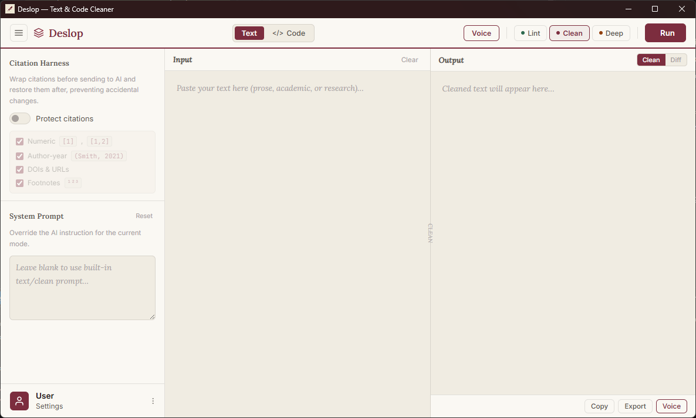

# Deslop

Deslop is a focused application designed to clean up text and remove AI "slop" (such as metalinguistic negation and repetitive phrasing) from generated content. It provides a clean, academic-inspired interface for refining text and editing voice prompts.



## Features

- **Text Cleaning:** Automatically removes unnecessary phrasing and "slop" from text, making it more direct and human-like.
- **Voice Editor:** A specialized interface for editing and refining voice-related text, with customizable tone flags.
- **Academic Aesthetic:** A distraction-free UI featuring a warm parchment background, deep burgundy accents, and serif typography.
- **GLM Integration:** Leverages the power of the GLM API for high-quality text processing.

## Installation

1. Clone the repository:
   ```bash
   git clone <repository-url>
   cd Deslop
   ```
2. Install dependencies:
   ```bash
   npm install
   ```
3. Run the application:
   ```bash
   npm start
   ```

## Usage

Simply paste your text into the main editor and click "Clean Content" to refine your text. Use the Voice tab to access the specialized editor and fine-tune output with tone flags.

## Architecture

Deslop is an Electron application built with standard web technologies (HTML, CSS, vanilla JavaScript). It has recently been optimized to route text analysis through the remote GLM API, removing the need for heavy local ML dependencies.

## License

ISC License
